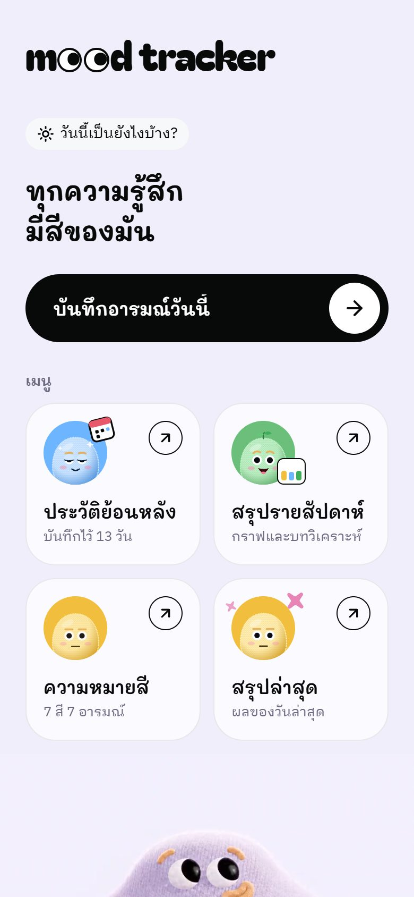
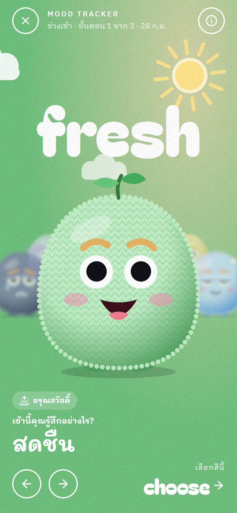
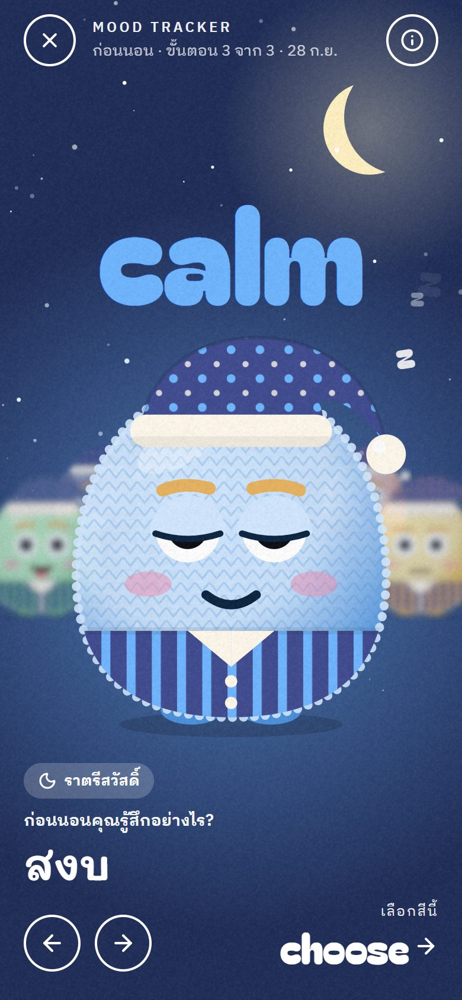
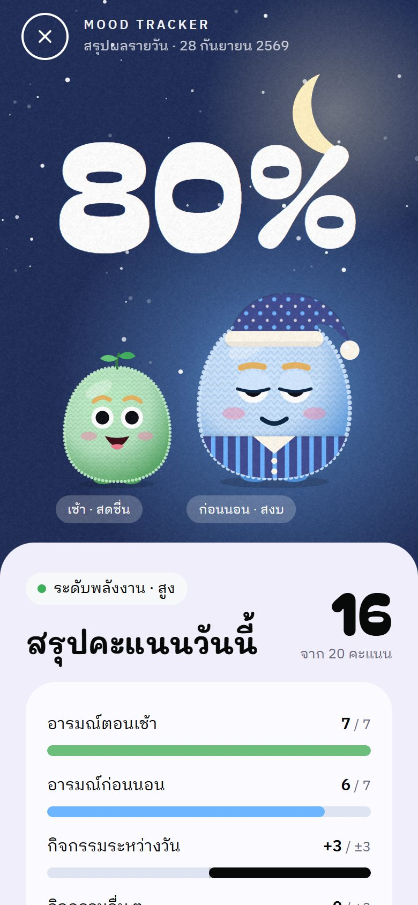
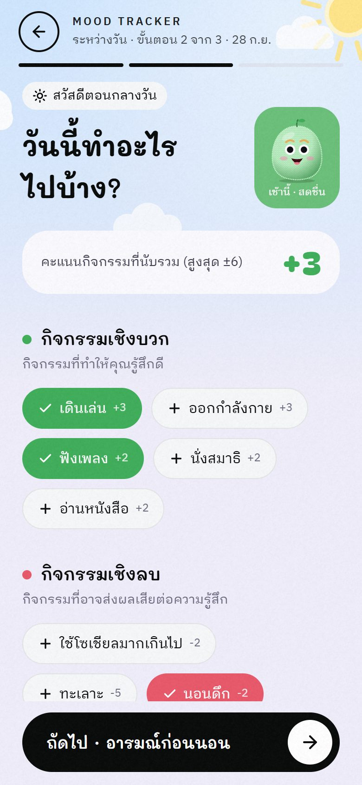
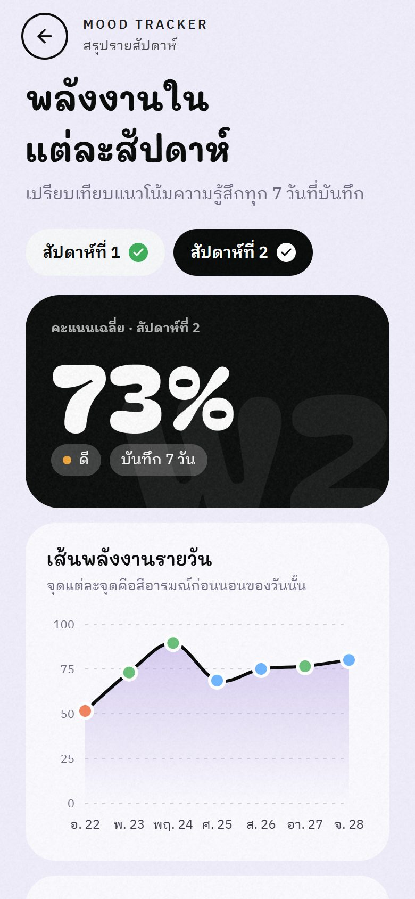
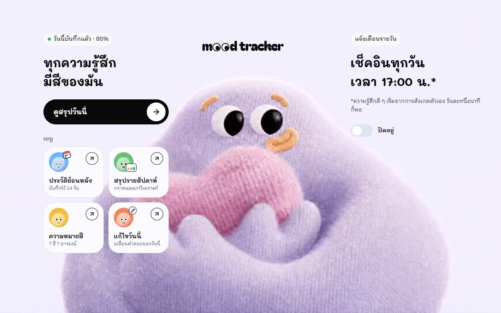

# MoodTrackerApp

> **A daily mood-tracking mobile app** (senior project / thesis) built with React Native, Expo and TypeScript. Users log their morning mood, daytime activities and bedtime mood through animated characters; the app turns them into a 0–20 "emotional energy" score with daily and weekly insights, charts and reminders. Highlights: a gesture-driven 3D-style character carousel, time-of-day themes (sunrise → daytime → bedtime), a video mascot whose eyes follow your finger, custom screen transitions, and a responsive layout from 320px phones to tablets. All data stays on the device.

<p align="center">
  
  
  
  
</p>

แอปพลิเคชันบันทึกอารมณ์รายวัน พัฒนาเป็นโปรเจกต์จบด้วย React Native, Expo และ TypeScript ผู้ใช้บันทึกอารมณ์ช่วงเช้า กิจกรรมระหว่างวัน และอารมณ์ก่อนนอน จากนั้นดูสรุปรายวัน ประวัติย้อนหลัง และแนวโน้มรายสัปดาห์ผ่านกราฟ

แอปไม่ได้ทำหน้าที่แค่จดบันทึก แต่คำนวณ "คะแนนพลังงานใจ" จากอารมณ์และกิจกรรม แล้วแสดงผลเป็น insight ที่อ่านง่าย เพื่อช่วยให้ผู้ใช้สังเกตความเปลี่ยนแปลงของอารมณ์ตนเอง

## ภาพหน้าจอ

| หน้าแรก | เลือกอารมณ์ช่วงเช้า | บันทึกกิจกรรม |
|:---:|:---:|:---:|
|  |  |  |
| **เลือกอารมณ์ก่อนนอน** | **สรุปผลรายวัน** | **สรุปรายสัปดาห์** |
|  |  |  |

แท็บเล็ตแนวนอน (เลย์เอาต์ 3 คอลัมน์ วิดีโอมาสคอตเต็มจอ)



> ภาพจับจากเวอร์ชันเว็บ (react-native-web) ด้วยข้อมูลตัวอย่าง ซึ่งใช้โค้ดชุดเดียวกับแอป iOS/Android

## จุดประสงค์ของโปรเจกต์

- สร้าง mobile application สำหรับติดตามอารมณ์และกิจกรรมในชีวิตประจำวัน
- ออกแบบ flow การใช้งานต่อเนื่อง ตั้งแต่การกรอกข้อมูลจนถึงการสรุปผล
- ใช้ local storage เก็บประวัติอารมณ์โดยไม่ต้องพึ่ง backend
- นำข้อมูลที่ผู้ใช้กรอกมาคำนวณและแสดงเป็นกราฟ เพื่อช่วยให้เข้าใจแนวโน้มอารมณ์ของตนเอง
- ฝึกพัฒนาแอปด้วย React Native, TypeScript, navigation, animation, data visualization และ notification

## ฟีเจอร์หลัก

- **เลือกอารมณ์ด้วยตัวละคร 7 สี** (สดชื่น สงบ เฉย ๆ เครียด หงุดหงิด ว่างเปล่า มืดมน)
  - เปลี่ยนตัวได้ทั้งปัด ลาก แตะตัวข้าง ๆ หรือกดลูกศร
  - พื้นหลังทั้งจอเปลี่ยนสีตามอารมณ์ ตัวละครข้าง ๆ เล็กลงและเบลอเพื่อให้เห็นมิติ
  - ตัวละครกะพริบตาและมองตามนิ้วผู้ใช้
  - กดค้างเพื่อเปิดความหมายของสีพร้อมแหล่งอ้างอิง
- **ธีมตามช่วงเวลาของวัน**
  - ช่วงเช้า: แสงอรุณ ดวงอาทิตย์ และเมฆลอย
  - ระหว่างวัน: ท้องฟ้าสีฟ้าในหน้าบันทึกกิจกรรม
  - ก่อนนอน: ท้องฟ้ากลางคืนมีดาวกับพระจันทร์ ตัวละครใส่หมวกนอนและชุดนอน
- **มาสคอตวิดีโอหน้าแรก**: มองตามจุดที่ผู้ใช้แตะ (บนเว็บมองตามเมาส์) โดยเลือกเฟรมจากตาราง gaze ที่วัดจากตำแหน่งรูม่านตาจริงในคลิป
- **เมนูหน้าแรกเป็นการ์ดที่มีมาสคอตเคลื่อนไหว** เพื่อให้ดูออกว่ากดได้
  - แต่ละเมนูมีของประกอบเฉพาะ เช่น ปฏิทินแกว่ง กราฟแท่งโต ตัวละครสลับสีครบ 7 อารมณ์ ดินสอดุ๊กดิ๊ก และประกาย
  - กดแล้วตัวละครกระโดด
- **บันทึกกิจกรรม**
  - แยกกิจกรรมเชิงบวก/เชิงลบ แสดงน้ำหนักคะแนนของแต่ละกิจกรรม และคะแนนรวมแบบสด
  - ให้คะแนนกิจกรรมอื่น ๆ ช่วง `-10` ถึง `+10` ด้วยสไลเดอร์ลากได้หรือปุ่ม +/- และรองรับ screen reader
- **สรุปผลรายวัน**
  - แสดงเปอร์เซ็นต์พลังงาน radar chart 5 มิติ breakdown คะแนน และคำแนะนำ
  - ส่วนหัวเล่นเป็น "วันผ่านไป" จากกลางวันเป็นกลางคืน
- **ประวัติย้อนหลัง**: แสดงตัวละครของแต่ละช่วงและแถบพลังงาน แตะรายการที่ยังบันทึกไม่ครบเพื่อทำต่อได้
- **สรุปรายสัปดาห์**: กราฟพลังงาน และปลดล็อกการวิเคราะห์เชิงจิตวิทยาเมื่อบันทึกครบ 7 วัน
- **แจ้งเตือนรายวันเวลา 17:00 น.**: แตะการแจ้งเตือนแล้วเข้าสู่การบันทึกของวันนี้ทันที
- **Responsive และการเข้าถึง**
  - รองรับตั้งแต่มือถือเล็ก (320px) ถึงแท็บเล็ต
  - แท็บเล็ตแนวนอนใช้เลย์เอาต์ 3 คอลัมน์
  - รองรับการตั้งค่าลดการเคลื่อนไหว (Reduce Motion)

## Tech Stack

- React Native 0.79 + Expo SDK 53
- TypeScript (strict)
- React Navigation Stack: JS stack พร้อม transition ที่เขียนเอง ทำงานทั้งบนมือถือและเว็บ
- React Native Reanimated 3 + Gesture Handler: carousel, gaze และ transitions
- React Native SVG: ตัวละคร, ฉากท้องฟ้า, กราฟ, blur ระยะชัดลึก
- Expo Video (มาสคอต), Expo Font, Expo Haptics, Expo Notifications
- AsyncStorage, Day.js (ปฏิทินไทย พ.ศ.)
- lucide-react-native (icons)
- react-native-web: สำหรับพรีวิวบนเบราว์เซอร์และ VS Code

## Design

ออกแบบโดยผสมสองแนวทาง:

- **Studio surface**: พื้นลาเวนเดอร์ `#F0EEFA` ตัวอักษรเกือบดำ `#080909` badge ทรง pill `#F7F8FA` และเลย์เอาต์โปร่ง ใช้กับหน้าแรก กิจกรรม ประวัติ และรายสัปดาห์
- **Mood stage**: สีอารมณ์เต็มจอ คำภาษาอังกฤษตัวใหญ่อยู่หลังตัวละคร ชั้น grain และปุ่มวงกลมเส้นขอบ ใช้กับหน้าเลือกอารมณ์และหน้าสรุปผล การเลื่อนของ carousel ใช้ 650ms `cubic-bezier(0.4, 0, 0.2, 1)`

**ธีมตามช่วงเวลา** (`src/theme/phase.ts`, `src/components/scenery/`)

| ช่วง | ใช้ที่ | องค์ประกอบ |
|---|---|---|
| เช้า | เลือกอารมณ์ช่วงเช้า | แสงอรุณ ดวงอาทิตย์รังสีหมุน เมฆลอย |
| ระหว่างวัน | บันทึกกิจกรรม | ท้องฟ้าสีฟ้า ดวงอาทิตย์มุมจอ เมฆ |
| ก่อนนอน | เลือกอารมณ์ก่อนนอน | พื้นกรมท่า ดาวกะพริบ พระจันทร์เสี้ยว ดาวตก แสงเรืองสีอารมณ์ ตัวละครใส่หมวกนอนและชุดนอน และ "z" ลอยขึ้น |
| กลางวัน → กลางคืน | สรุปผลรายวัน | แดดจางลง ดาวและแสงเรืองค่อย ๆ ขึ้น |

**การเปลี่ยนหน้า** (`src/navigation/transitions.ts`)

- หน้าทั่วไป: สไลด์แบบ parallax หน้าเดิมเลื่อนออก เล็กลง และมืดลง
- เริ่มบันทึก / หน้าสรุป: หน้าใหม่ยกขึ้นจากด้านล่าง
- เข้าช่วงก่อนนอน: "ค่ำลง" หน้าเดิมมืดเป็นสีกรมท่า แล้วฉากกลางคืนค่อย ๆ ปรากฏ

**ฟอนต์**

- Bagel Fat One: คำอังกฤษและตัวเลขขนาดใหญ่ ทรงอ้วนกลมเข้ากับตัวละครถัก
- Mali (Cadson Demak): หัวข้อภาษาไทย ลายมือกลมมีหัว
- IBM Plex Sans Thai Looped: เนื้อหาภาษาไทยแบบมีหัว อ่านง่าย

## User Flow

1. หน้า Home → "บันทึกอารมณ์วันนี้"
2. เลือกอารมณ์ช่วงเช้า (ขั้นตอน 1/3)
3. บันทึกกิจกรรมระหว่างวัน (ขั้นตอน 2/3)
4. เลือกอารมณ์ก่อนนอน (ขั้นตอน 3/3)
5. ดูสรุปรายวัน ถ้าพลังงานต่ำจะมีข้อความดูแลใจ
6. ถ้าออกกลางคัน ปุ่มหน้า Home จะเปลี่ยนเป็น "บันทึกต่อจากเดิม" เมื่อบันทึกครบแล้วจะเปลี่ยนเป็น "ดูสรุปวันนี้"

## โครงสร้างโปรเจกต์

```text
MoodTrackerApp/
├── index.ts                     # registerRootComponent
├── app.json
├── assets/
│   ├── textures/grain.png       # 200×200 noise tile
│   └── video/mascot.mp4         # all-intra H.264 สำหรับ seek แบบเฟรมต่อเฟรม
└── src/
    ├── App.tsx                  # fonts, splash, providers, notification routing
    ├── navigation/              # RootNavigator, transitions, typed params
    ├── screens/                 # Home, MoodPicker, ActivityLog, Summary, History, Weekly, ColorMeaning
    ├── components/
    │   ├── ui/                  # Txt, Pill, CircleButton, PrimaryButton, MenuTile, Toggle, Sheet, TopBar, GrainOverlay
    │   ├── mood/                # MoodCharacter (SVG + ชุดนอน), MoodCarousel, GhostWords, MoodMeaningList
    │   ├── mascot/              # GazeMascot (video scrubbing), gazeFrames, Wordmark, MenuMascot
    │   ├── scenery/             # Sky (เช้า/กลางวัน/กลางคืน), MoodGlow, SleepyZ
    │   ├── charts/              # RadarChart, EnergyLineChart, ProgressRing
    │   └── activity/            # ActivityChip, ScoreSlider
    ├── constants/               # moods (สี, ความหมาย, แหล่งอ้างอิง), activities (น้ำหนักคะแนน)
    ├── domain/                  # scoring (คะแนน/insight ทั้งหมดอยู่ที่นี่), dates
    ├── storage/                 # AsyncStorage entries
    ├── store/                   # EntriesProvider (context)
    ├── services/                # notifications, haptics
    ├── hooks/                   # useResponsive, useSvgId
    ├── theme/                   # colors, fonts, motion, phase (ธีมตามช่วงเวลา)
    └── types/
```

## Data Model

ข้อมูลหลักของแต่ละวันถูกเก็บเป็น `MoodEntry`

```ts
export type MoodEntry = {
  date: string;         // YYYY-MM-DD (เวลาท้องถิ่น)
  morningMood: MoodColor;
  nightMood: MoodColor;
  positiveActivities: string[];
  negativeActivities: string[];
  otherActivityScore: number;
  otherActivityNote: string;
  totalScore: number;   // คำนวณใหม่ทุกครั้งที่บันทึก (0–20)
  completed?: boolean;  // false ระหว่างที่ยังไม่ได้เลือกอารมณ์ก่อนนอน
};
```

ข้อมูลเก็บใน `AsyncStorage` ภายใต้ key `mood_entries`:
- ข้อมูลจากเวอร์ชันก่อนยังใช้ได้ทั้งหมด entry เก่าที่ไม่มี `completed` ถือว่าบันทึกครบแล้ว
- ทุกหน้าจออ่าน/เขียนผ่าน `EntriesProvider` ที่เดียว

## Scoring Logic

- อารมณ์ถูก map เป็นคะแนน `1–7`: green = 7, blue = 6, yellow = 5, orange = 4, red = 3, gray = 2, black = 1
- คะแนนกิจกรรมมาจากตาราง `src/constants/activities.ts` และคะแนนรวมถูกจำกัดช่วง `-3` ถึง `+3` โดยใช้เหมือนกันทั้งรายวัน radar และรายสัปดาห์
- คะแนนกิจกรรมอื่น ๆ ที่ผู้ใช้ให้เองถูกจำกัดช่วง `-10` ถึง `+10` แล้ว normalize เป็น `-3` ถึง `+3`
- คะแนนรวมรายวัน (0–20):

```text
morning mood score + night mood score + activity score + normalized other activity score
```

จากนั้นแปลงเป็นเปอร์เซ็นต์ แล้ววิเคราะห์ระดับพลังงานรายวัน (ต่ำ < 8, กลาง ≤ 14, สูง) หรือแนวโน้มและความผันผวนรายสัปดาห์ การคำนวณทั้งหมดอยู่ใน `src/domain/scoring.ts`

## Screens

- `HomeScreen`
  - wordmark ที่ตัว o เป็นลูกตา และมาสคอตวิดีโอ
  - ปุ่มบันทึก / บันทึกต่อ / ดูสรุป
  - การ์ดเมนูที่มีมาสคอต และสวิตช์แจ้งเตือน
- `MoodPickerScreen`: ใช้ทั้งช่วงเช้าและก่อนนอน (param `period`) เป็น carousel ตัวละคร 7 สี พร้อมธีมตามช่วงเวลา
- `ActivityLogScreen`: กิจกรรมเชิงบวก/ลบ กิจกรรมอื่น สไลเดอร์คะแนน และโน้ต
- `SummaryScreen`: ผลรายวัน radar chart คำแนะนำ และข้อความดูแลใจเมื่อพลังงานต่ำ
- `HistoryScreen`: ประวัติย้อนหลัง (2 คอลัมน์บนจอกว้าง)
- `WeeklyScreen`: กราฟพลังงานรายสัปดาห์ และการวิเคราะห์เมื่อครบ 7 วัน
- `ColorMeaningScreen`: ความหมายของสีทั้ง 7 พร้อมแหล่งอ้างอิง

## Notification

ระบบแจ้งเตือนอยู่ใน `src/services/notifications.ts`

- ขอ permission ครั้งเดียวตอนเปิดแอป ส่วนการเปิด/ปิดทำผ่านสวิตช์หน้า Home ถ้าถูกปฏิเสธจะพาไปหน้า Settings ได้
- สร้าง Android notification channel และตั้งแจ้งเตือนรายวัน 17:00 น.
- resync schedule ทุกครั้งที่เปิดแอป เพื่อป้องกัน schedule หาย
- แตะการแจ้งเตือนแล้วเปิดหน้าบันทึกอารมณ์ของวันนี้

## วิธีติดตั้งและรันโปรเจกต์

ต้องมี Node.js เวอร์ชัน LTS (พัฒนาและทดสอบด้วย Node.js 24)

```bash
npm install          # ติดตั้ง dependencies
npm start            # Expo development server แล้วสแกน QR ด้วยแอป Expo Go (SDK 53)
npm run web          # รันบนเบราว์เซอร์ที่ http://localhost:8081
npm run typecheck    # ตรวจ TypeScript
```

build แบบ native (ต้องติดตั้ง Android Studio หรือ Xcode ก่อน)

```bash
npm run android      # expo run:android
npm run ios          # expo run:ios (macOS เท่านั้น)
```

build สำหรับติดตั้ง/ขึ้น store ผ่าน EAS ดูค่าได้ที่ `eas.json` (profile: development, preview, production)

### พรีวิวใน VS Code

1. รัน `npm run web` (เซิร์ฟเวอร์จะอยู่ที่พอร์ต 8081)
2. เปิดส่วนขยาย **Mobile Preview - Phone & Tablet Simulator** ด้วย `Ctrl+Shift+P` → **Mobile Preview: Show**
3. ถ้าส่วนขยายไม่พบเซิร์ฟเวอร์เอง ให้ใส่ `http://localhost:8081` ในช่อง URL

หมายเหตุ:
- **พรีวิวบนเว็บ**: เหมาะกับการตรวจเลย์เอาต์และขนาดจอ แต่การแจ้งเตือนและการสั่นใช้ได้เฉพาะบนมือถือ
- **ประสิทธิภาพ**: ความลื่นของแอนิเมชันควรทดสอบบนอุปกรณ์จริงหรือ emulator
- **การแจ้งเตือน**: แนะนำให้ทดสอบบน development build หรือ build จริง เพราะ Expo Go จำกัดความสามารถด้านการแจ้งเตือนบางส่วน

## เวอร์ชัน 2 — สิ่งที่เปลี่ยนจากเวอร์ชันแรก

- **โครงสร้างโค้ด**: รื้อใหม่ตามแนวทาง React Native / Expo ย้ายโค้ดทั้งหมดไปไว้ใน `src/` แยกเป็น navigation, screens, components, domain, storage, store, services และ theme
- **การคิดคะแนน**: เดิมเขียนซ้ำอยู่ 3 ที่ ตอนนี้รวมไว้ที่ `domain/scoring.ts` ที่เดียว และหน้ารายสัปดาห์จำกัดคะแนนกิจกรรมที่ ±3 เหมือนหน้าอื่นแล้ว
- **ข้อมูล**:
  - บันทึก `totalScore` จริง (เดิมเป็น 0 ตลอด)
  - เพิ่ม `completed` เพื่อแยกวันที่บันทึกไม่ครบ
- **UX/UI ใหม่ทั้งหมด**: ตัวละคร 7 สี ธีมตามช่วงเวลา แอนิเมชันเปลี่ยนหน้า เมนูแบบการ์ด และรองรับหลายขนาดจอ
- **แก้บั๊ก**:
  - แตะการแจ้งเตือนแล้วแอปพัง เพราะเปิดหน้าสรุปโดยไม่มีวันที่
  - การแจ้งเตือนขอ permission ซ้ำจนเด้งเตือนรัว ๆ
  - ปุ่ม "ไปที่การตั้งค่า" ไม่ทำงาน
- **Dependencies**: ถอดตัวที่ไม่ได้ใช้ออก ได้แก่ react-native-chart-kit, react-native-linear-gradient, react-native-vector-icons และ patch-package

## เครดิต

- แนวทางการออกแบบ UI ได้แรงบันดาลใจจาก reference design 2 ชุด ได้แก่ footer ของ creative studio (พื้นลาเวนเดอร์และมาสคอตที่มองตามเคอร์เซอร์) และ character carousel (สีเต็มจอและคำขนาดใหญ่ด้านหลัง) แล้วนำมาปรับใช้กับแอปมือถือ
- ตัวละครอารมณ์ทั้ง 7 ตัว ชุดนอน และฉากท้องฟ้า วาดด้วย SVG ในโปรเจกต์นี้
- ฟอนต์ Bagel Fat One, Mali, IBM Plex Sans Thai Looped จาก Google Fonts (SIL Open Font License) ผ่าน `@expo-google-fonts`
- ไอคอนจาก [Lucide](https://lucide.dev) (ISC License)
- วิดีโอมาสคอตแปลงจากคลิปต้นฉบับ 1920×1080 (HEVC) เป็น H.264 แบบ all-intra ความละเอียด 720p เพื่อให้ seek ตามนิ้วได้ลื่น
